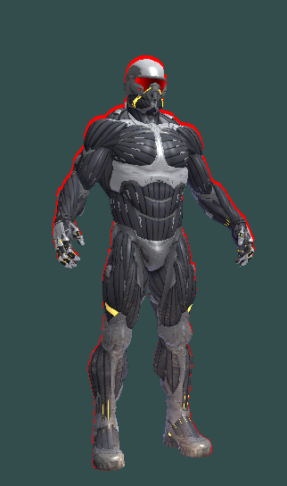
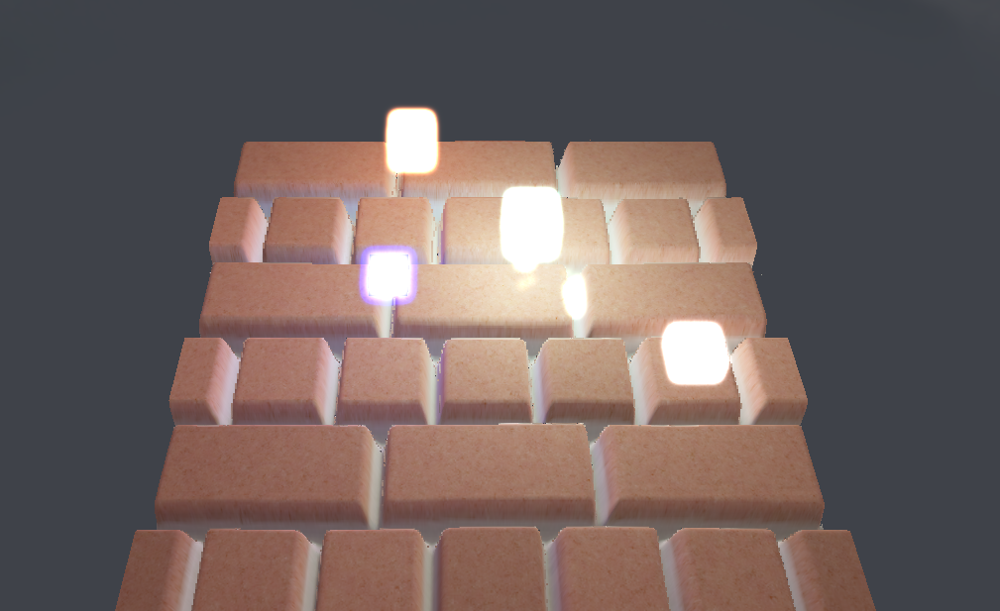
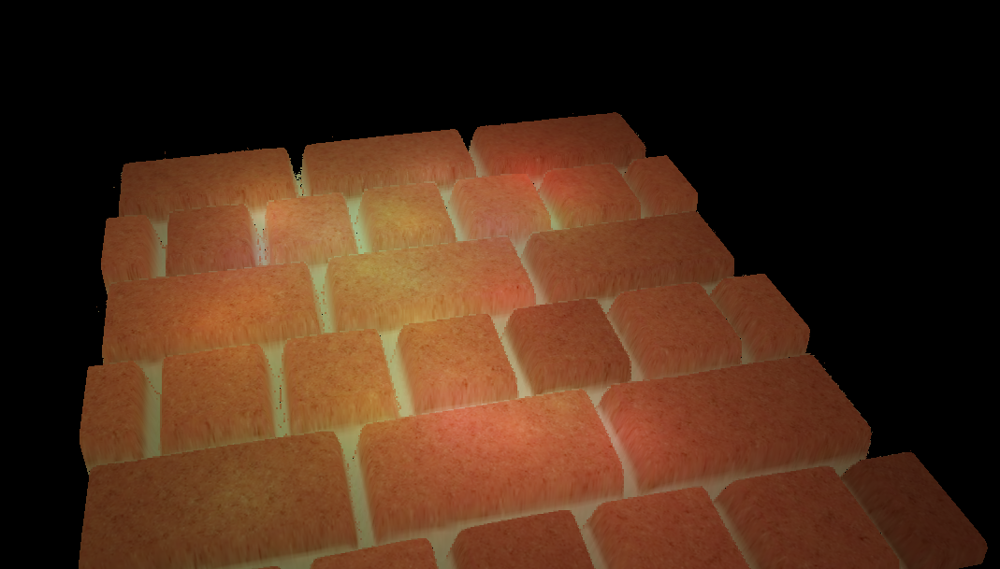
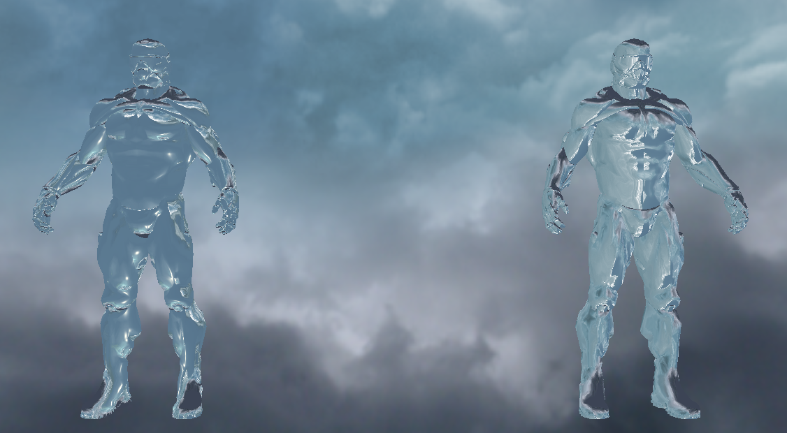
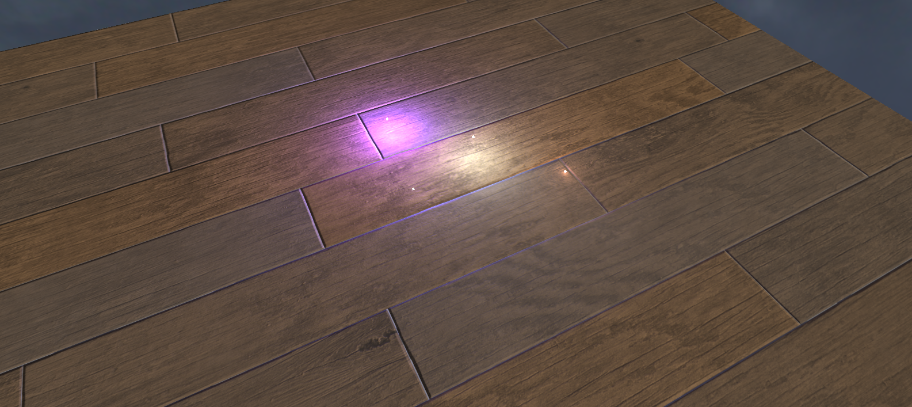
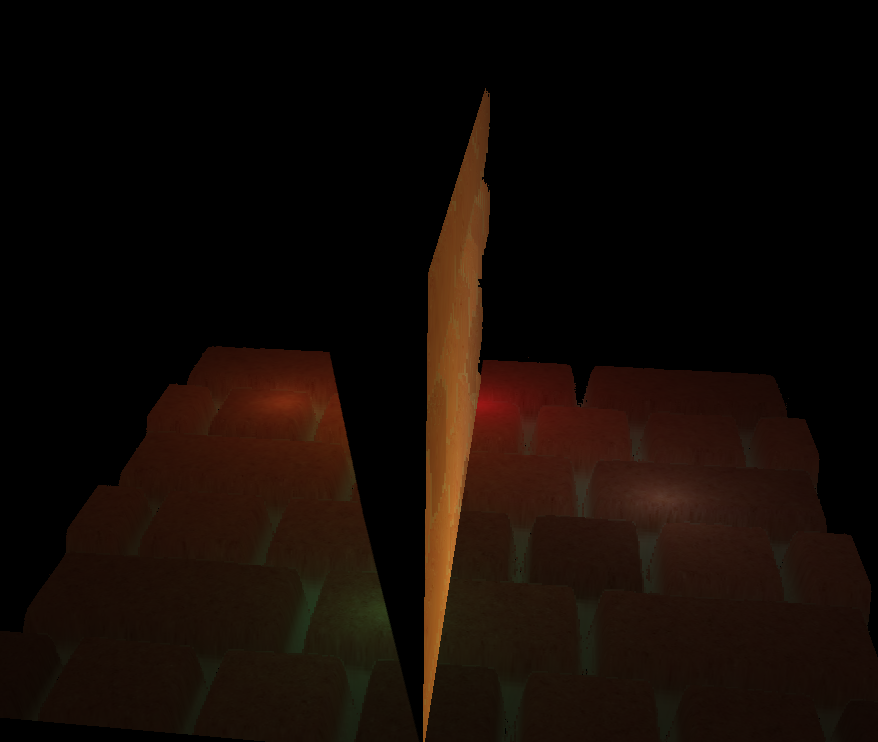

# OpenGL

This repository is nothing more that just my draft outline of the https://learnopengl.com course. I didn't spend extra time on code acrhitecture on else. Some revisions may be missing files that were added later or have shader mistakes like missing variables. The master's HEAD revision should work fine.

Here are a few screenshots:

